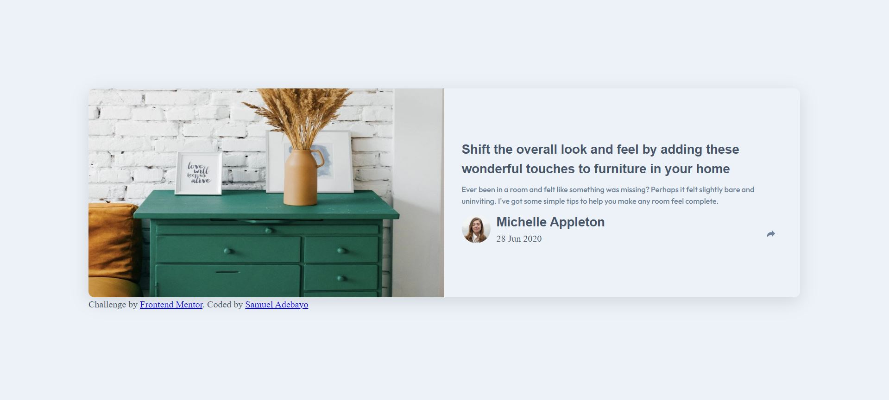
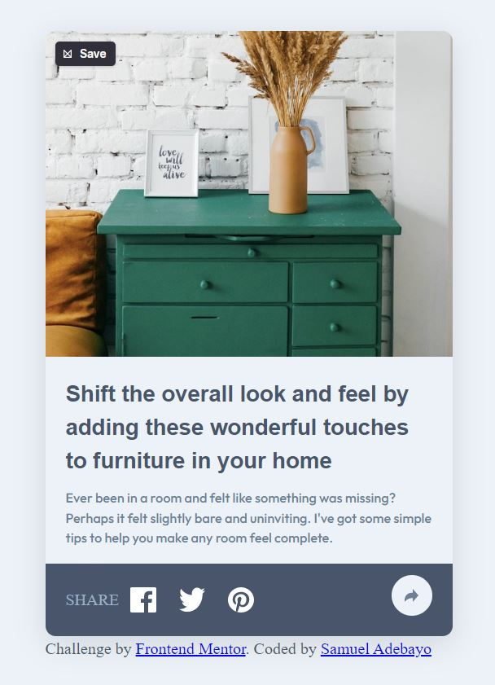

# Frontend Mentor - Article preview component solution

This is a solution to the [Article preview component challenge on Frontend Mentor](https://www.frontendmentor.io/challenges/article-preview-component-dYBN_pYFT). Frontend Mentor challenges help you improve your coding skills by building realistic projects.

## Table of contents

-  [Overview](#overview)
   -  [The challenge](#the-challenge)
   -  [Screenshot](#screenshot)
   -  [Links](#links)
-  [My process](#my-process)
   -  [Built with](#built-with)
   -  [What I learned](#what-i-learned)
   -  [Continued development](#continued-development)
   -  [Useful resources](#useful-resources)
-  [Author](#author)
-  [Acknowledgments](#acknowledgments)

## Overview

A very interesting beginner project indeed, helped me understand and improve my basic skills in front-end designing

### The challenge

Users should be able to:

-  View the optimal layout for the component depending on their device's screen size
-  See the social media share links when they click the share icon

### Screenshot

### Links

-  Solution URL: [Add solution URL here](https://your-solution-url.com)
-  Live Site URL: [Add live site URL here](https://your-live-site-url.com)

## My process

I was able to start building this using the mobile first design on my CSS and I made use of SASS and git for practice purposes

### Built with

-  Semantic HTML5 markup
-  Flexbox
-  CSS Grid
-  SASS
-  Mobile-first workflow
-  Vanilla Javascript

### What I learned

I learned more on using SASS and also improved my use of DOM manipulators in Javascript

### Continued development

I do need to practice more on DOM manipulation and also responsive designs later in future

### Useful resources

www.w3scools.org

## Author

-  Frontend Mentor - [@repzy001](https://www.frontendmentor.io/profile/repzy001)
-  Twitter - [@samuel_ade0001](https://www.twitter.com/samuel_ade0001)

## Acknowledgments
